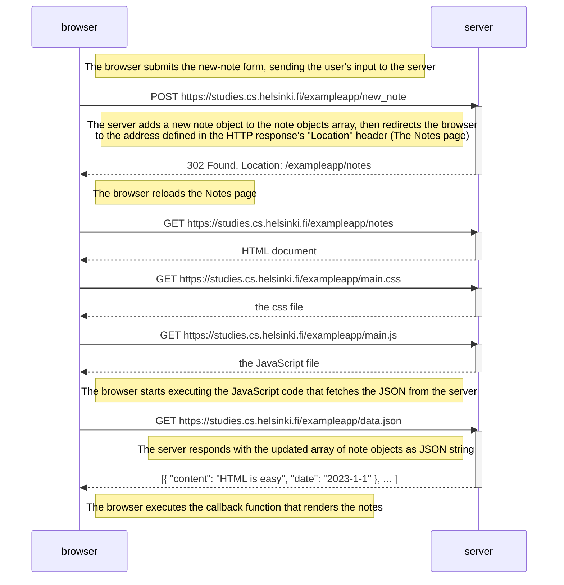

# New Note Diagram

```mermaid

sequenceDiagram;
    participant browser;
    participant server;

    Note right of browser: The browser submits the new-note form, sending the user's input to the server

    browser->>server: POST https://studies.cs.helsinki.fi/exampleapp/new_note

    activate server
    Note left of server: The server adds a new note object to the note objects array, then redirects the browser <br/>  to the address defined in the HTTP response's "Location" header (The Notes page)
    server-->>browser: 302 Found, Location: /exampleapp/notes
    deactivate server

    Note right of browser: The browser reloads the Notes page

    browser->>server: GET https://studies.cs.helsinki.fi/exampleapp/notes
    activate server
    server-->>browser: HTML document
    deactivate server

    browser->>server: GET https://studies.cs.helsinki.fi/exampleapp/main.css
    activate server
    server-->>browser: the css file
    deactivate server

    browser->>server: GET https://studies.cs.helsinki.fi/exampleapp/main.js
    activate server
    server-->>browser: the JavaScript file
    deactivate server

    Note right of browser: The browser starts executing the JavaScript code that fetches the JSON from the server

    browser->>server: GET https://studies.cs.helsinki.fi/exampleapp/data.json
    activate server
    Note left of server: The server responds with the updated array of note objects as JSON string
    server-->>browser: [{ "content": "HTML is easy", "date": "2023-1-1" }, ... ]
    deactivate server

    Note right of browser: The browser executes the callback function that renders the notes

```
