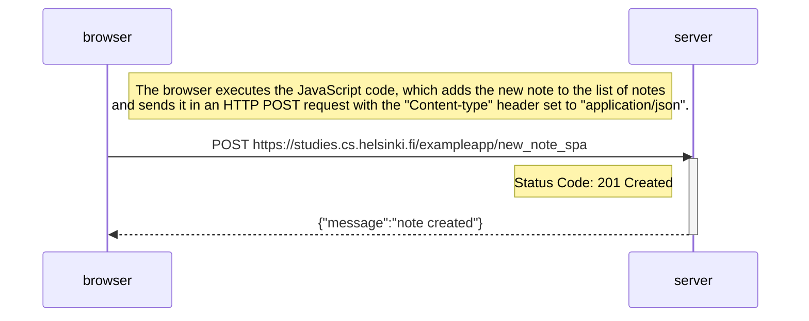

# SPA New Note Diagram

```mermaid

sequenceDiagram;
    participant browser;
    participant server;

    Note right of browser: The browser executes the JavaScript code, which adds the new note to the list of notes <br/> and sends it in an HTTP POST request with the "Content-type" header set to "application/json".
    browser->>server: POST https://studies.cs.helsinki.fi/exampleapp/new_note_spa

    activate server
    Note left of server: Status Code: 201 Created
    server-->>browser: {"message":"note created"}
    deactivate server

```
